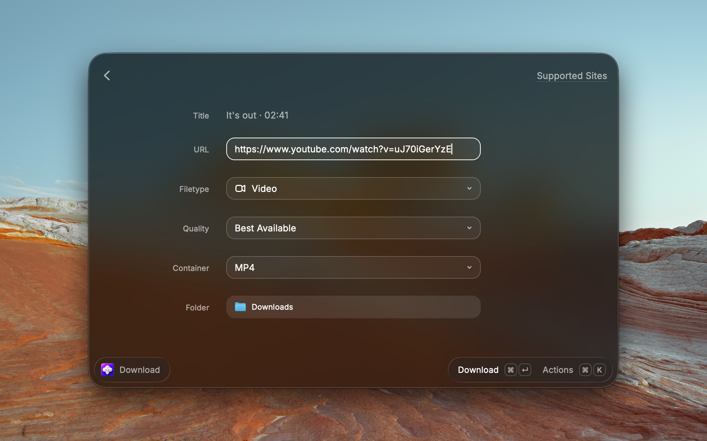

# The Downloader

Download videos, audio, image galleries, Spotify music, and complete webpages from the web — straight from Raycast.



## Commands

- **Download** — paste a URL, choose what to grab (video, audio, image, transcript, or webpage) and the quality, then download.
- **Fast Download** — pass a URL as a command argument and download it instantly using your saved defaults — no form.

## What you need

The Downloader drives a few command-line tools:

- **yt-dlp** — videos and audio
- **ffmpeg** (with **ffprobe**) — audio extraction and format conversion
- **gallery-dl** — image galleries
- **spotDL** — Spotify tracks, albums, and playlists
- **monolith** — complete webpages saved as a single HTML file
- **Deno** *(optional)* — JavaScript runtime that makes yt-dlp's YouTube extraction more reliable

The extension installs any required tool that is missing for you on first use. yt-dlp, ffmpeg, gallery-dl, and monolith install via Homebrew on macOS:

```bash
brew install yt-dlp ffmpeg gallery-dl monolith
```

Deno is optional and never blocks a download, but installing it (`brew install deno` on macOS, `winget install DenoLand.Deno` on Windows) is recommended if you download from YouTube — yt-dlp uses it to solve YouTube's JavaScript challenges.

spotDL is not on Homebrew — the extension downloads its prebuilt binary directly the first time you use the Spotify feature, fetching it from [spotDL's official GitHub Releases](https://github.com/spotDL/spotify-downloader/releases) over HTTPS and ad-hoc codesigning it on macOS. The prebuilt binary is x86_64-only, so Apple Silicon Macs need Rosetta 2 (`softwareupdate --install-rosetta --agree-to-license`); alternatively, install spotDL via `brew install spotdl` for a native Apple-Silicon Python build.

## Supported sites

See [SUPPORTED_SITES.md](https://github.com/raycast/extensions/blob/main/extensions/the-downloader/SUPPORTED_SITES.md).

## Login-gated galleries

To download from sites that require a login, point the extension at a browser you're already signed into. See [BROWSER_COOKIES.md](https://github.com/raycast/extensions/blob/main/extensions/the-downloader/BROWSER_COOKIES.md).

## Spotify downloads

Spotify links need a one-time Developer app setup so spotDL can fetch track metadata. See [SPOTIFY.md](https://github.com/raycast/extensions/blob/main/extensions/the-downloader/SPOTIFY.md).

## Credits

This extension builds on the [Video Downloader](https://www.raycast.com/vimtor/video-downloader) extension by vimtor and contributors.
